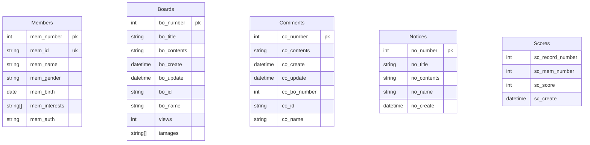

# 데이터베이스론

---
---

<br/>

---

<br/>

## 데이터베이스

<br/>

### 데이터란?

관측된 결과를 기호로 표현한것.

<br/>

### 데이터베이스란?

최소한의 중복으로 저장된 통합, 공유, 운영하기 위한 특정한 데이터들의 모음.

<br/>

### DBMS(Database Management System)

데이터베이스를 생성하고 관리하는 프로그램으로, 질의 해석기와 데이터 접근기로 이루어져 있습니다.

<br/>

### 카탈로그(catalog)

데이터베이스에 대한 정의, 제약조건, 구조, 인덱스등의 정보를 담고있는 메타데이터의 모음입니다.

<br/>

### 데이터베이스 시스템(Database System)

클라이언트 어플리케이션 + DBMS + 카탈로그 + 데이터베이스

<br/>

<br/>

---

<br/>

## 릴레이션(테이블)

<br/>

### 속성

테이블의 열에 해당하는 데이터들의 집합입니다.

<br/>

### 튜플

테이블의 행에 해당하는 데이터들의 순서가 없는 집합입니다.

<br/>

### 릴레이션 스키마

테이블의 가장 첫행에 적혀있는 자료구조를 릴레이션의 스키마라고 합니다.

<br>

### 릴레이션

어트리뷰트, 튜플, 스키마를 합쳐서 릴레이션이라고 지칭합니다.

<br>

---

<br>

## 무결성 제약조건

<br>

#### 엔티티 무결성 제약조건

기본키는 NULL 값이 될 수 없는것을 엔티티 무결성 제약조건이라고 합니다.

<br>

#### 키 무결성 제약조건

서로 다른 튜플은 동일한 키를 가질 수 없다는 것을 키 무결성 제약조건이라고 합니다.

<br>

#### NOT NULL 무결성 제약조건

튜플을 구성하는데 필수적인 속성이 NULL이면 안 되는 것을 NOT NULL 무결성 제약조건이라고 합니다.

<br>

#### 도메인 무결성 제약조건

속성은 원자적이어야 하며 허용되지 않는 값이 존재해서는 안되는 것을 도메인 무결성 제약 조건이라고 합니다.

<br>

#### 의미적 무결성 제약조건

의미적으로 허용되지 않는 값이 존재해서는 안 되는 것을 의미적 무결성 제약조건이라고 합니다.

<br>

#### 참조 무결성 제약조건

외래키의 속성은 기본키의 속성과 동일한 도메인을 가져야 한다는 것을 참조 무결성 제약조건이라고 합니다.


<br/>

---

<br/>


## 키(key)


릴레이션(테이블)에서 튜플의 식별자

<br/>

### 슈퍼키

튜플을 식별할 수 있는 속성들의 집합

<br/>

### 후보키

튜플을 식별하는데 필요한 속성들로만 이루어진 슈퍼키

<br/>

### 기본키

릴레이션을 대표하는 후보키

<br/>

### 대체키(유니크키)

기본키를 제외한 후보키

<br/>

---

<br/>

## 관계형 데이터베이스 설계

<br/>

### 관계형 모델 설계 과정

<br/>

#### 요구 사항 분석 -> 데이터 모델링 -> ER-관계 사상 -> 구현

<br/>

### ERD의 엔티티와 속성

#### 엔티티(Entity)

릴레이션을 ERD에서는 엔티티라고 부른다.

<br/>

#### 속성(Attribute)

엔티티에 속해 있으며 엔티티를 설명하는 요소이다.

<br/>

#### 복합 속성

여러 세부 속성으로 구성된 속성

<br/>

#### 단순 속성

복합 속성이 아닌 속성

<br/>

#### 저장된 속성

실제로 스토리지에 저장되는 속성

<br/>

#### 유도된 속성

저장된 속성을 이용하여 연산을 통해 유도되는 속성

<br/>

#### 단일 속성

더 이상 쪼갤 수 없는 원자값만 존재하는 속성

<br/>

#### 다치 속성

여러 개의 값이 존재하는 속성


<br/>


#### 관계(Relationship)

엔티티와 엔티티간의 어떤 관계인지 개념적으로 설명하는 요소.

<br/>

### 기본키에 해당하는 속성

ERD에서 기본키는 속성의 이름에 밑줄을 그어서 표현한다.

<br/>



```erDiagram

    Members {
        int mem_number pk
        string mem_id uk
        string mem_name
        string mem_gender
        date mem_birth
        datetime mem_create
        string mem_auth
    }

    Products {
        int pro_number pk
        string pro_name
        string pro_explain
        string pro_main_image
        datetime pro_register
        int pro_price
        int pro_stock
    }

    Categories {
        string cat_name pk
        string[] cat_product
        datetime cat_register
    }

    Orders {
        int ord_number pk
        int ord_total
        int ord_discount
        int ord_card_charge
        datetime ord_request
        datetime ord_complete
        int ord_state
    }

    Coupons {
        int cou_number pk
        string cou_category
        int cou_discount
        datetime cou_use
        string cou_used
        string cou_name
    }

    Notices {
        int not_number pk
        string not_title
        string not_contents
        string not_name
        datetime not_create
    }

```

<br/>

### ERD의 관계와 카디날리티

<br/>

#### 카디날리디

엔티티 간의 관계에 대한 차수이다. 관계로는 1:1 ,1:N, N:M이 있다.
관계에서도 속성을 가질 수 있다.

#### 약한 엔티티

자신을 식별할 수 있는 키를 다른 엔티티를 참조하는 외래키와 자신의 보조키를 가지고 만드는 엔티티를 약한 엔티티라고한다. (기본키=외래키+보조적인속성)


<br/>

### 개념적 설계와 ERD(관계, 참여)

#### 전체 참여: 엔티티에 속하는 원소의 모든 집합이 관계에서 전체 참여해야한다.

#### 부분 참여: 엔티티에 속하는 원소의 모든 집합이 부문만 참여해야한다.


<br/>

---

<br/>

## 관계대수

<br/>

### 셀렉트 : σ <논리식 또는 조건> (릴레이션)  = SELECT * FROM (테이블) WHERE <논리식 또는 조건>

<br/>

### 프로젝트 : π <속성 리스트> (릴레이션) = SELECT <컬럼 리스트> FROM (테이블)

<br/>

### 카티션 곱 (릴레이션1) x (릴레이션2) = SELECT * FROM (테이블1) (테이블2)

<br/>

### 동등 조인 : (릴레이션1) ⋈ <조인 조건> (릴레이션2) = SELECT * FROM (테이블1) INNER JOIN  (테이블2) ON <조인조건> 

<br/> 

#### 자연 조인 : (릴레이션1) * <속성 리스트1>, <속성 리스트2> (릴레이션) = 동등 조인 한 후 중복 속성 제거

<br/>

#### 합집합 : (릴레이션1) ∪ (릴레이션2) = SELECT * FROM A UNION SELECT * FROM B; (단, 속성의 개수(차수)와 도메인이 동일해야하는 타입 호환성을 만족해야한다.)

<br/>

#### 교집합 : (릴레이션1) ∪ (릴레이션2) = SELECT * FROM A INTERECT SELECT * FROM B; (단, 속성의 개수(차수)와 도메인이 동일해야하는 타입 호환성을 만족해야한다.)

<br/>

#### 차집합 : (릴레이션1) ∪ (릴레이션2) = SELECT * FROM A EXCEPT SELECT * FROM B; (단, 속성의 개수(차수)와 도메인이 동일해야하는 타입 호환성을 만족해야한다.)

<br/>

#### 디비전 : (릴레이션1) % (릴레이션2) = 릴레이션1의 튜플에서 릴레이션2에 존재하는 모든 튜플을 가져온다.
릴레이션3 <= π <찾고자 하는 속성> (릴레이션1)
릴레이션4 <= π <찾고자하는 속성> (릴레이션1에서의 찾고자하는 속성값 테이블 X 릴레이션3 - 릴레이션1)
결과 릴레이션 <= 릴레이션3 - 릴레이션4


<br/>

---

<br/>

## 정규화

릴레이션의 중복을 손실없이 최소화하는 과정을 말한다. 결과를 만족하는 조건을 정규형이라고도 한다.

<br/>
<br/>

### 제 1 정규형

스카마에서 속성의 의미가 명확한지 확인하여, 도메인이 원자값만 갖도록한다. 제 1 정규화는 다치값을 갖는 속성을 수평적으로 먼저 분리하여, 외래키등을 참조하는 속성을 덧붙여서 투플들을 식별하도록 릴레이션을 만드는 방법이다.

<br/>
<br/>

### 제 2 정규형

튜플들에서 중복되는 값이 있는지 확인하여, 제 1 정규형을 만족하면서 비주요 속성(비후보키)이 기본키에 부분 종속이 아닌 완전종속 되도록 한다. 제 2 정규화 과정은 기본키에 부분 종속되는 관계들을 따로 떼어내어 분리하는 방법이다.

<br/>
<br/>

### 제 3 정규형

튜플들에 저장된 NULL값들을 확인하여, 제 2 정규형을 만족하면서 모든 함수적 종속적 관계 X -> Y에 대하여 X가 슈퍼키이거나 Y가 후보키가 되도록한다. 제 3 정규화는 이행적 함수 종속 관계들을 분리하는 방법이다.

<br/>
<br/>
#### BCNF

가짜 튜플이 만들어지는지 확인하여, 제 3 정규형을 만족하고 모든 함수적 종속적 관계 X-> Y에 대하여 X가 슈퍼키가 되도록한다. BCNF 정규화는 튜플을 분리하여 가짜 튜플이 만들어지지 않도록 (R1 ∩ R2) -> (R1 - R2) 또는 (R1 ∩ R2) -> (R2 - R1)를 만족하는 릴레이션을 찾는 방법이다.


<br/>

---

<br/>

## 인덱스

<br/>

### 1. 주기억장치와 보조기억장치

프로그램을 실행시 모든 데이터를 주기억장치에 적제하지 않고 필요한 데이터만 가져와서 적제한다. 보조기억장치는 CPU가 직접 데이터를 가져오지 않고, Controller가 보조기억장치에서 요청 데이터를 읽어 버퍼에 저장해놓습니다. 그러나 보조기억장치는 느리기때문에, DBMS는 데이터를 읽어올 때 다양한 자료구조와 SQL 파서, 옵티마이저를 통해 사용자의 질의한 구문이 무엇인지 해석 후 데이터를 어떻게 읽어올지 계산합니다.

<br/>
<br/>

### 2. 인덱스

자료구조는 메모리에서만 쓰이는게 아닌 보조기억장치의 파일과 같은 데이터에서도 사용되는데, 인덱스는 보조기억장치에서 필요로하는 블록이나 레코드에 빠르게 접근하기위한 파일 형태의 자료구조이다. 기본적으로 인덱스필드와 레코드 포인터 필드로 구성되어 있다. 즉, 데이터에 빠르게 접근하기위한 자료구조 형태의 레이블이다.

<br/>

기본적으로 인덱스(기본인덱스)로 레코드(투플)들의 집합인 블록을 보조기억장치에서 주기억장치로 가져와서 데이터를 찾습니다. 인덱스 필드값을 어떤걸로 하느냐 혹은 레코드 포인터값을, 자료구조를 어떻게 하느냐에 따라 인덱스의 종류는 달라집니다.

<br/>

또한 DBMS의 인덱스는 레코드의 키값을 기준으로 항상 정렬되기 때문에, 탐색성능은 좋더라도 저장하는 데이터가 많아질수록 삽입 성능이 좋지 않는 경향이 있다.

<br/>

#### 참고) 데이터베이스의 데이터 명칭 정리

|개념적|논리적|물리적|
|--------|------|-----------|
|릴레이션|테이블|블록(페이지)
|튜플|행|레코드|
|속성|컬럼|필드|

<br/>

#### 2.1. 기본 인덱스

인덱스의 키값이 기본키로 하여 파일 블록(레코드)에 접근하는 방식으로 가장 기본적인 형태의 인덱스이다.

<br/>

#### 2.2. 보조 인덱스

기본키가 아닌 주요속성로 인덱스 필드값으로하는 파일형태의 자료구조이다. 주요속성으로 일일히 파일레코드를 매칭시켜야하기 때문에, 기본 인덱스보다 많은 블록이나 레코드에 대한 인덱스 엔트리를 요구한다.

<br/>

#### 2.3. 클러스터링 인덱스

주요속성이 아닌 비주요속성을 기준으로 인덱스 레코드를 정렬시켜 구성하는 파일형태의 자료구조이다. 단, 삭제/삽입시 재배치가 번거롭다는 문제가 있다.

<br/>

#### 2.4. 다단계 인덱스

인덱스 레코드 포인터의 값을 인덱스를 가리키도록하는 계층구조의 파일형태 자료구조 이다. 리프 계층에 레코드의 포인터값이 저장되며 보통 B+Tree를 많이 이용하여 구현합니다. 다중 분류에 유리하다.

  
<br/>

#### 2.5. 해시인덱스

다중 버킷으로 구성된 파일형태의 자료구조이다. 해시함수로 인덱스 필드의 값을 해싱하여 해당하는 버킷에 저장하거나 값을 버킷에서 검색하여 해당하는 파일 블록 및 레코드에 접근한다.

<br/>
<br/>

### 3. DBMS Index(Mysql8.0 InnoDB엔진기준)

<br/>

#### 3.1. 클러스터 인덱스(B+Tree)

레코드를 식별하는 키를 기준으로 레코드를 정렬하는 자료구조입니다. 레코드 식별키를 보통 클러스터키라고 명칭되며, 이 클러스터키는 보통 기본키가 됩니다. 만약 기본키가 없다면 NOT NULl UNIQUE KEY가 대신하고, NOT NULL UNIQUE KEY도 없다면 자체적으로 자동 증가 필드값을 만들어 기본키를 대신합니다. 테이블 생성시 자동으로 클러스터 인덱스가 생성 됩니다.

<br/>

#### 3.2. 보조인덱스(B+Tree)

클러스터 인덱스를 제외한 나머지 인덱스를 보조인덱스라고 합니다. 기본키를 제외한 키를 식별자로하여 포인터필드는 클러스터키를 저장하고있습니다. 보조인덱스로는 대표적으로 유니크인덱스, 외래키인덱스, 일반 컬럼인덱스가 있고, 공간인덱스, 전문(TEXT)등과 같은 인덱스도 있습니다. 키를 지정하는것이 사실상 인덱스를 추가하는것과 동일합니다. 유니크 인덱스, 외래키 인덱스, 일반 컬럼인덱스, 클러스터 인덱스는 B+Tree의 구조를 가지고 있습니다.

<br/>

#### 3.2.1. 유니크키 인덱스(유니크 키)

보조키를 유니크키로 지정하는 인덱스입니다. 유니크 키를 추가하거나 지정하는것과 동일하며, CREATE UNIQUE INDEX 인덱스_이름 ON 테이블이름(컬럼1, 컬럼2,...)와 같은 질의어를 이용하여 만들 수 도 있습니다.

<br/>

#### 3.2.2. 외래키 인덱스(외래키)

보조키를 외래키로 지정하는 인덱스입니다. 외래키를 추가하거나 지정하는것과 동일합니다.

<br/>

#### 3.2.3. 칼럼 인덱스

최대 16개의 복수 컬럼으로 보조키를 지정하는 인덱스입니다. 반드시 가로안에 한꺼번에 지정하여야하며, 따로 개별적으로 혹은 동시에 추가하는것(개별적으로 인덱스가 만들어짐)과 컬럼의 순서에 따라 인덱스가 달라지므로 주의하여야합니다. 추가하는 방법은 다음과 같습니다.

<br/>

CREATE TABLE MEMBER (
    ...
    INDEX 인덱스_이름 (칼럼1, 칼럼2, 칼럼3) # 복수의 인덱스
    ...
);

<br/>

CREATE INDEX 인덱스_이름 ON (칼럼1, 칼럼2, 칼럼3, 칼럼4, 칼럼5, 칼럼6, 칼럼7, 칼럼8, 칼럼9, ...);

<br/>

ALTER TABLE 테이블_이름 ADD INDEX 인덱스_이름 (칼럼1, 칼럼2, ...);


<br/>

#### 3.3 인덱스 삭제 및 조회

<br/>

#### 3.3.1. 삭제

인덱스를 삭제하는 경우는 거의없으나 삭제하는 방법은 다음과 같습니다.

<br/>

ALTER TABLE 테이블_이름 DROP INDEX 인덱스_이름;

<br/>

#### 3.2. 조회

다음과 같은 질의어로 인덱스에 대한 정보를 조회할수 있습니다. 조회시 Cardinality는 식별되는 값들의 수입니다. (단, 추정치 이므로 주의하여야합니다.)

<br/>

SHOW INDEX FROM 테이블_이름;

<br/>
<br/>

### 4. 인덱스와 옵티마이저 실행계획(MySql 8.0기준)

옵티마이저 실행계획 보는 질의어

>EXPLAIN [format=tree|json] [SELECT 구문]

>EXPLAIN SELECT * FROM MEMBER WHERE M_ID = 2;

<br/>

#### 4.1. 설명

<br/>

##### 4.1.1. type: 조인타입을 의미합니다.
##### 4.1.2. const : 일치하는 행이 최대 하나만 있는 경우
##### 4.1.3. range : 일치하는 행이 범위인 경우
##### 4.1.3. All : 전체 레코드를 스캔하는 경우
##### 4.1.4. index : 전체 인덱스를 스캔하는 경우
##### 4.1.5. ref: 인덱스에 일치되는 행을 여러개 스캔하는 경우

<br/>

#### 4.2. possible_keys : 질의시 사용될수 있는 인덱스

<br/>

#### 4.3. key : 질의 시 실제로 사용된 인덱스

<br/>

#### 4.4. extra : 옵티마이저가 질의를 어떻게 해석했는지 대한 정보
#### 4.4.1. Using Index : 레코드까지 접근하지 않고 인덱스까지만 접근한 경우(단, 보조인덱스의 클러스터키까지 접근한것인지 클러스터인덱스의 클러스터키까지 접근하는 접근한것인지는 DBMS마다 차이가 있습니다.)
#### 4.4.2. Backward index scan : 인덱스의 키를 정방향이 아닌 역방향으로 스캔한 경우
#### 4.4.3. Using filesort : ORDER BY를 사용하는 추가적인 단계가 있는 경우
#### 4.4.4. Using where : 조건절을 이용하여 탐색 범위를 축소한 경우

<br/>
<br/>

### 5. 옵티마이저 탐색

<br/>

#### 5.1.1. 클러스터 인덱스

<br/>

클러스터키로 지정된 키를 탐색을한다.

<br/>

#### 5.1.2. 유니크키 인덱스

<br/>

정렬된 유니크키를 탐색하여 적절한 레코드의 위치를 찾는다.

<br/>

#### 5.1.3. 다중컬럼 인덱스

<br/>

정렬된 다중컬럼으로 레코드의 위치를 찾는다. 단, 다중컬럼으로 인덱스로 사용할시에는 다중 컬럼의 순서에 유의하여야한다. 테이블이 성별,이름이 있는 있다고 가정하여 인덱스를 (성별,이름)으로하고 남자인 김철수를 찾는다면, 우선 남자인 사람중에서 해당하는 김철수를 찾겠지만, (이름, 성별)이라면 김철수를 찾아서 남자인지 확인하기위해 모든 레코드를 탐색하러 다녀야할 수 있기때문이다.

<br/>

#### 5.1.4. 인덱스가 아닌 컬럼

<br/>

인덱스가 아닌 컬럼으로 탐색을하면 모든 레코드를 탐색한다. 때문에 인덱스를 고려하면서 질의어를 만들어야한다.

<br/>

#### 5.1.5. 인덱스와 정렬

<br/>

인덱스는 정렬되어있는데, 기본적으로 오름차순으로 정렬되어있다. 그러나 인덱스에 임의적으로 정렬을 지정할 수 있는데, 검색의 정렬 방향과 인덱스의 정렬 방향이 서로 다르다면 레코드의 끝에서부터 특별한 접근방식으로 탐색을 시작한다. 이렇게 되면 탐색성능이 저하될 수 있다.

<br/>
<br/>

### 5.2 대용량 처리 방법

<br/>

#### 1. 질의구문 튜닝

<br/>

#### 2. 인덱스

<br/>

#### 3. 캐싱
저장소를 따로두어 매시간마다 집계를 하거나해서 미리 데이터를 만들어 놓는 방법이다.


<br/>

---

<br/>

## 트랜잭션

<br/>

### 1. 트랜잭션이란?

질의문들로 이루어진 하나의 논리적 작업이다. BEGIN같이 명시적으로 선언할 수도 직접 선언할 수도 있다. 사실 질의문자체가 트랜잭션의 일종이기도 하다. COMMIT이나 ROLLBACK으로 트랜잭션의 끝맺음을 해주어야 이 명령어들은 데이터베이스에 반영하거나 작업취소하는 질의어이다. 그 전까지는 명시적인 잠금이 아닌한 히스토리 로그에만 처리결과가 저장된다. 그리고 AUTO-COMMIT의 여부에 따라 명시적으로 끝맺음을 해줄필요가 없다. 그래서 DB접속시 COMMIT을 해주지않아도 변경될 수 있다.

<br/>
<br/>

### 2. 트랜잭션의 성질

<br/>

#### 2.1. 원자성

트랜잭션의 작업은 절대로 부분처리완료가 될 수 가 없다.

<br/>

#### 2.2. 일관성

<br/>

트랜잭션 처리 완료 후에도 데이터베이스의 무결성과 일관성을 보장해야한다.

<br/>

#### 2.3. 고립성

<br/>

각 세션들의 트랜잭션을 동시 처리할때 서로에게 영향을 주지 않게 보여야한다.

<br/>

#### 2.4. 지속성

<br/>

트랜잭션 처리완료 후 데이터베이스에 반영이 지속되어야 한다.

<br/>
<br/>

### 3. 트랜잭션의 동시성 문제와 잠금

<br/>

#### 동시성 문제

세션의 트랜잭션의 동시 처리시 발생하는 처리결과 기준 선택 문제

<br/>

#### 잠금

동시성 문제를 해결하기 위한 방법으로, 자바의 임계성 문제와같이 세션이 데이터에 접근시 가지는 권한을 일컫는다. 잠금을 명시적으로 묵시적으로 하느냐, 읽기만하느냐 쓰기도 하느냐, 테이블이냐 레코드냐에 따라 잠금의 종류는 달라진다.

<br/>

#### 명시적잠금과 묵시적잠금

명시적 잠금은 FOR SHARE, FOR WRITE,LOCK TABLE ... READ, LOCK TABLE ... WRITE같이 덧붙이거나 직접 선언 할 수 있는 반면에, 묵시적 잠금은 UPDATE나 DELETE, INSERT같이 읽고 쓸때 질의처리기가 암묵적으로 선언해주는 잠금이다.

<br/>

#### 공유적 잠금과 베타적 잠금

읽을 데이터의 일관성을 위한 공유적 잠금과 수정,입력,삭제시 접근을 제한하는 베타적 잠금이 있다. 공유적 잠금은 같은 공유적 잠금이면 읽을 수 있지만, 베타적 잠금은 같은 베타적 잠금이여도 대기하여야한다. 공유적 잠금은 FOR SHARE 혹은 TABLE ... READ로, 베타적 잠금은 FOR WRITE 혹은 TABLE ... WRITE로 선언할 수 있다. 공유적 잠금은 SELECT에서도 선언이 가능하다.

<br/>

#### 인텐션 잠금과 테이블 잠금

인텐션 잠금은 특정 레코드의 데이터만 잠금을 하지만, 테이블 잠금은 히스토리 로그를 포함한 전체의 데이터를 잠금시킨다. 그래서 인텐션 잠금은 배타적이여도 서로 범위가 다르면 충돌하지 않지만, 베타적 테이블 잠금은 잠금이 아니여도 읽을 수가 없다.

<br/>

#### 참고) DBMS에서 잠금의 대기시간을 조절할 수 있다.

<br/>
<br/>

### 4. 고립성

고립성이란 앞서 말한대로 트랜잭션끼리 영향을 최소화 하기 위한 성질인데, 정도에따라 READ_UNCOMMITED, READ_COMMITED, REPEATABLE-READ, SERIALIZABLE 순으로 보통 나뉜다. 하지만, DBMS에 따라 지원되는 단계는 다를 수 있으니 유의해야 한다.

<br/>

#### 4.1.READ_UNCOMMITED
가장 엄격하지않은 고립성 1단계으로써, 한 세션에서 잠금중이고 다른 세션들에서 읽을때 변경됬지만 커밋되지않은 데이터를 히스토리 로그에서 읽어 온다. 이를 Dirty-Read라고 부른다. 커밋후에는 테이블에서 직접 읽어온다.

<br/>

#### 4.2.READ_COMMITED

그 다음으로 엄격한 고립성 2단계으로써, 한 세션에서 잠금중 데이터 변경중 이더라도, 변경 데이터는 히스토리 로그에 기록해놓고 다른 세션들에서 읽을때는 테이블에서 직접 읽어오기때문에 서로 영향을 주지 않을 수 있다. 즉, 테이블에서만 읽어오는 고립성 단계이다. 그러나 커밋 시점에 따라서 동일한 질의라도 결과물이 달라 질 수 있다.

<br/>

#### 4.3. REPEATABLE-READ

그 다음으로 엄격한 고립성 3단계이다. 테이블로 명시적인 잠금으로 데이터를 읽어오지 않는 이상, 무조건 히스토리 로그에서만 데이터를 읽어오는데, 히스토리 로그 커밋 여부 상관없이 트랜잭션시 혹은 변경전 히스토리 로그 데이터만 읽어온다. 인텐션 락을 이용한 경우 예상치 못한 결과가 발생 할 수 있다.

<br/>

#### 4.4. SERIALIZABE

가장 엄격한 고립성 4단계이다. 트랜잭션 내에서 변경 질의가 전달될 경우, 다른 명시적인 트랜잭션 내에서 락을 가진 트랜잭셔만 테이블의 데이터에 접근이 가능하다. 잠금방식이 아닌 질의일 경우에는 히스토리 로그를 통해 데이터를 가져온다.