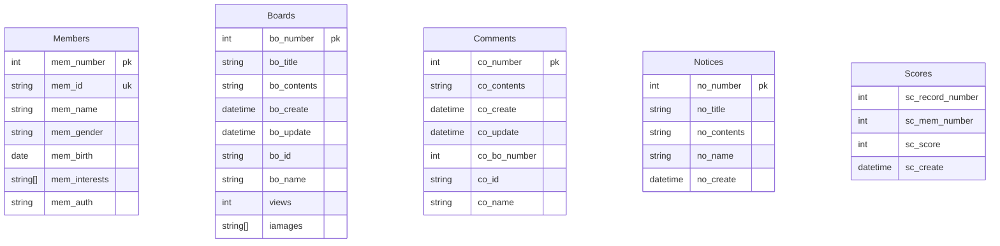

# 데이터베이스론

---
---

<br/>

---

<br/>

## 데이터베이스

<br/>

### 데이터란?

관측된 결과를 기호로 표현한것.

<br/>

### 데이터베이스란?

최소한의 중복으로 저장된 통합, 공유, 운영하기 위한 특정한 데이터들의 모음.

<br/>

### DBMS(Database Management System)

데이터베이스를 생성하고 관리하는 프로그램으로, 질의 해석기와 데이터 접근기로 이루어져 있습니다.

<br/>

### 카탈로그(catalog)

데이터베이스에 대한 정의, 제약조건, 구조, 인덱스등의 정보를 담고있는 메타데이터의 모음입니다.

<br/>

### 데이터베이스 시스템(Database System)

클라이언트 어플리케이션 + DBMS + 카탈로그 + 데이터베이스

<br/>

<br/>

---

<br/>

## 릴레이션(테이블)

<br/>

### 속성

테이블의 열에 해당하는 데이터들의 집합입니다.

<br/>

### 튜플

테이블의 행에 해당하는 데이터들의 순서가 없는 집합입니다.

<br/>

### 릴레이션 스키마

테이블의 가장 첫행에 적혀있는 자료구조를 릴레이션의 스키마라고 합니다.

<br>

### 릴레이션

어트리뷰트, 튜플, 스키마를 합쳐서 릴레이션 또는 테이블이라고 지칭합니다.

<br>

---

<br>

## 무결성 제약조건

<br>

#### 엔티티 무결성 제약조건

기본키는 NULL 값이 될 수 없는것을 엔티티 무결성 제약조건이라고 합니다.

<br>

#### 키 무결성 제약조건

서로 다른 튜플은 동일한 키를 가질 수 없다는 것을 키 무결성 제약조건이라고 합니다.

<br>

#### NOT NULL 무결성 제약조건

튜플을 구성하는데 필수적인 속성이 NULL이면 안 되는 것을 NOT NULL 무결성 제약조건이라고 합니다.

<br>

#### 도메인 무결성 제약조건

속성은 원자적이어야 하며 허용되지 않는 값이 존재해서는 안되는 것을 도메인 무결성 제약 조건이라고 합니다.

<br>

#### 의미적 무결성 제약조건

의미적으로 허용되지 않는 값이 존재해서는 안 되는 것을 의미적 무결성 제약조건이라고 합니다.

<br>

#### 참조 무결성 제약조건

외래키의 속성은 기본키의 속성과 동일한 도메인을 가져야 한다는 것을 참조 무결성 제약조건이라고 합니다.


<br/>

---

<br/>


## 키(key)


릴레이션(테이블)에서 튜플의 식별자

<br/>

### 슈퍼키

튜플을 식별할 수 있는 속성들의 집합

<br/>

### 후보키

튜플을 식별하는데 필요한 속성들로만 이루어진 슈퍼키

<br/>

### 기본키

릴레이션을 대표하는 후보키

<br/>

### 대체키(유니크키)

기본키를 제외한 후보키

<br/>

---

<br/>

## 관계형 데이터베이스 설계

<br/>

### 관계형 모델 설계 과정

<br/>

#### 요구 사항 분석 -> 데이터 모델링 -> ER-관계 사상 -> 구현

<br/>

### ERD의 엔티티와 속성

#### 엔티티(Entity)

릴레이션을 ERD에서는 엔티티라고 부른다.

<br/>

#### 속성(Attribute)

엔티티에 속해 있으며 엔티티를 설명하는 요소이다.

<br/>

#### 복합 속성

여러 세부 속성으로 구성된 속성

<br/>

#### 단순 속성

복합 속성이 아닌 속성

<br/>

#### 저장된 속성

실제로 스토리지에 저장되는 속성

<br/>

#### 유도된 속성

저장된 속성을 이용하여 연산을 통해 유도되는 속성

<br/>

#### 단일 속성

더 이상 쪼갤 수 없는 원자값만 존재하는 속성

<br/>

#### 다치 속성

여러 개의 값이 존재하는 속성


<br/>


#### 관계(Relationship)

엔티티와 엔티티간의 어떤 관계인지 개념적으로 설명하는 요소.

<br/>

### 기본키에 해당하는 속성

ERD에서 기본키는 속성의 이름에 밑줄을 그어서 표현한다.

<br/>



```erDiagram

    Members {
        int mem_number pk
        string mem_id uk
        string mem_name
        string mem_gender
        date mem_birth
        datetime mem_create
        string mem_auth
    }

    Products {
        int pro_number pk
        string pro_name
        string pro_explain
        string pro_main_image
        datetime pro_register
        int pro_price
        int pro_stock
    }

    Categories {
        string cat_name pk
        string[] cat_product
        datetime cat_register
    }

    Orders {
        int ord_number pk
        int ord_total
        int ord_discount
        int ord_card_charge
        datetime ord_request
        datetime ord_complete
        int ord_state
    }

    Coupons {
        int cou_number pk
        string cou_category
        int cou_discount
        datetime cou_use
        string cou_used
        string cou_name
    }

    Notices {
        int not_number pk
        string not_title
        string not_contents
        string not_name
        datetime not_create
    }

```

<br/>

### ERD의 관계와 카디날리티

<br/>

#### 카디날리디

엔티티 간의 관계에 대한 차수이다. 관계로는 1:1 ,1:N, N:M이 있다.
관계에서도 속성을 가질 수 있다.

#### 약한 엔티티

자신을 식별할 수 있는 키를 다른 엔티티를 참조하는 외래키와 자신의 보조키를 가지고 만드는 엔티티를 약한 엔티티라고한다. (기본키=외래키+보조적인속성)


<br/>

### 개념적 설계와 ERD(관계, 참여)

#### 전체 참여: 엔티티에 속하는 원소의 모든 집합이 관계에서 전체 참여해야한다.

#### 부분 참여: 엔티티에 속하는 원소의 모든 집합이 부문만 참여해야한다.


<br/>

---

<br/>

## 인덱스

<br/>

### 1. 주기억장치와 보조기억장치

프로그램을 실행시 모든 데이터를 주기억장치에 적제하지 않고 필요한 데이터만 가져와서 적제합니다. 보조기억장치는 CPU가 직접 데이터를 가져오지 않고, Controller가 보조기억장치에서 요청 데이터를 읽어 버퍼에 저장해놓습니다. 그러나 보조기억장치는 느리기때문에, DBMS가 다양한 자료구조와 SQL 파서, 옵티마이저를 통해 사용자의 질의한 구문이 무엇인지 해석 후 데이터를 어떻게 읽어올지 계산합니다.

<br/>

### 2. 인덱스

자료구조는 메모리에서만 쓰이는게 아닌 보조기억장치의 파일과 같은 데이터에서도 사용되는데, 인덱스는 보조기억장치에서 필요로하는 블록이나 레코드에 빠르게 접근하기위한 파일 형태의 자료구조입니다. 기본적으로 인덱스필드와 레코드 포인터 필드로 구성되어있습니다.

<br/>

기본적으로 인덱스(기본인덱스)는 레코드(투플)들의 집합인 블록을 보조기억장치에서 주기억장치로 가져와서 찾습니다. 인덱스 필드값을 어떤걸로 하느냐 혹은 레코드 포인터값을, 자료구조를 어떻게 하느냐에 따라 인덱스의 종류는 달라집니다.

<br/>

또한 DBMS의 인덱스는 레코드의 키값을 기준으로 항상 정렬되기 때문에, 탐색성능은 좋더라도 저장하는 데이터가 많아질수록 삽입 성능이 좋지 않습니다.

<br/>

#### 기본 인덱스

기본키로 레코드에 접근하는 방식으로 가장 기본적인 형태의 레코드 접근 자료구조입니다.

<br/>

#### 보조 인덱스

기본키가 아닌 후보키로 인덱스 필드값으로하는 파일형태의 자료구조입니다. 레코드는 기본키로 정렬되어 있기때문에 보통 기본 인덱스보다 많은 파일 엔트리를 요구합니다.

<br/>

#### 클러스터링 인덱스

슈퍼키가 아닌 필드를 기준으로 정렬하여 구성하는 파일형태의 자료구조 입니다. 단, 삭제/삽입시 재배치가 발생하는 문제가 있습니다.

<br/>

#### 다단계 인덱스

레코드 포인터의 필드값을 인덱스를 가리키는 계층구조의 인덱스 파일입니다. 리프 계층에 레코드의 포인터값이 저장되며 보통 B+Tree를 많이 이용하여 구현합니다. 다중 분류에 유리합니다.

  

#### 해시인덱스

다중 버킷으로 구성된 인덱스 파일입니다. 해시함수로 인덱스 필드의 값을 해싱하여 해당하는 버킷에 저장하거나 값을 버킷에서 검색하여 해당하는 레코드에 접근합니다.


<br/>

---

<br/>